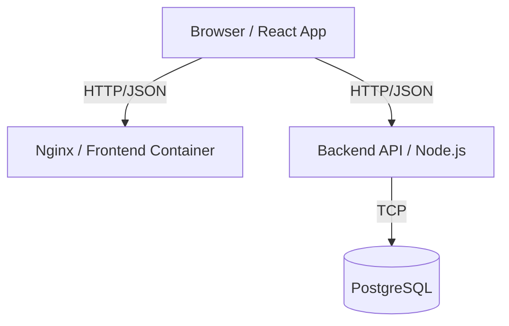

# Blog Starter Project

A production-ready starter project for a simple blog-style web app.

## Features

- **Read Posts**: View all blog posts on the home page.
- **Create Posts**: Authenticated users can create new posts.
- **Authentication**: Register and Login functionality.
- **Modern Design**: Colorful, responsive UI with gradients and animations using Tailwind CSS.

## Tech Stack

- **Frontend**: React + TypeScript + Vite + Tailwind CSS
- **Backend**: Node.js + TypeScript + Express
- **Database**: PostgreSQL with Prisma ORM
- **Infrastructure**: Docker & Docker Compose

## Architecture



## Prerequisites

- Docker
- Docker Compose

## Getting Started

1.  **Clone the repository**

2.  **Environment Setup**
    The project comes with default `.env` configuration for Docker.

3.  **Run with Docker Compose**
    ```bash
    docker-compose up --build
    ```
    This will start:
    - Frontend at [http://localhost:3000](http://localhost:3000)
    - Backend at [http://localhost:4000](http://localhost:4000)
    - Database (Postgres)

4.  **Initialize & Seed Database** (First time only)
    
    Push the database schema:
    ```bash
    docker-compose exec backend npx prisma db push
    ```

    Seed with initial data:
    ```bash
    docker-compose exec backend npm run seed
    ```

## Development & Troubleshooting

### Windows & Google Drive Users
If you are running this project from a Google Drive folder (`G:\...`) on Windows, Docker volumes may fail to mount properly.

- **Workaround Applied**: Volume mounting (Hot Reload) is disabled in `docker-compose.yml` to prevent errors.
- **Consequence**: You must re-run `docker-compose up --build` to see any code changes.
- **Recommendation**: For Hot Reloading, move the project to a local drive (e.g., `C:\Work\blog-starter`) and uncomment the `volumes` sections in `docker-compose.yml`.

### Access Data
- **Demo User**: `alice@example.com`
- **Password**: `password123`

## API Endpoints

- `POST /api/auth/register`
- `POST /api/auth/login`
- `GET /api/posts`
- `GET /api/posts/:id`
- `POST /api/posts` (Auth required, Title & Body)
- `PUT /api/posts/:id` (Owner only)
- `DELETE /api/posts/:id` (Owner only)

## Deployment

1.  **Build images**:
    ```bash
    docker build -t my-blog-backend ./backend
    docker build -t my-blog-frontend ./frontend
    ```
2.  **Run**: Use `docker-compose.prod.yml` as a reference for production deployment settings.
