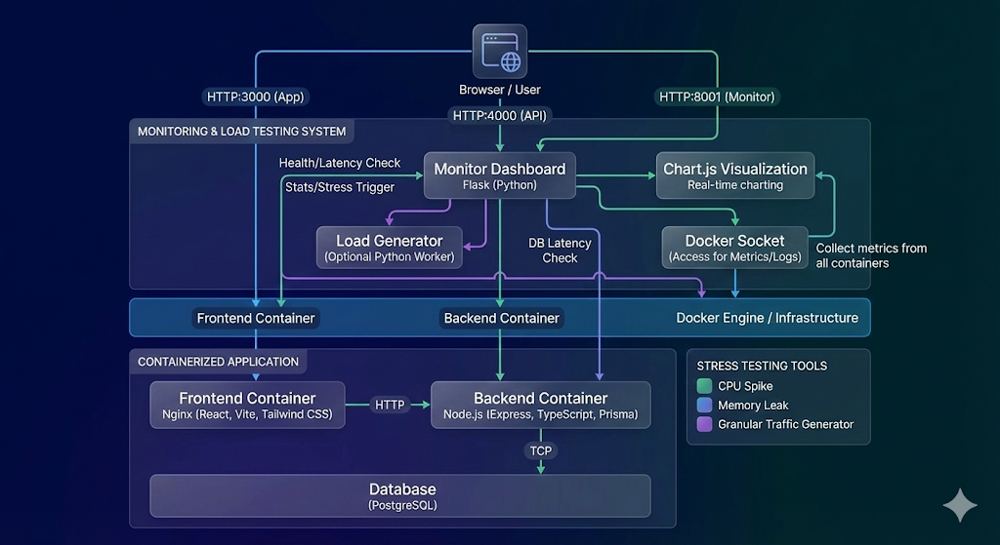

# Blog Starter Project

A production-ready starter project for a simple blog-style web app, now featuring a **High-Performance Monitoring & Load Testing System**.

## Features

### Core Application
- **Read Posts**: View all blog posts on the home page.
- **Create Posts**: Authenticated users can create new posts.
- **Authentication**: Register and Login functionality.
- **Modern Design**: Colorful, responsive UI with gradients and animations using Tailwind CSS.

### Monitoring & Load Testing (New!)
- **Visual Dashboard**: A dedicated dashboard running on a separate Flask service.
- **Real-time Charts**:
    - **Latency**: Granular tracking for **Frontend** (Web), **Backend** (API), and **Database** (SQL) latency.
    - **Load**: Live graph of concurrent users/requests split by target.
    - **Resources**: Aggregate CPU and Memory usage monitoring.
- **Granular Traffic Generator**:
    - **Frontend Load**: Simulate users hitting the Nginx web server.
    - **Backend Load**: Simulate API traffic (`GET /api/posts`).
    - **Database Load**: Execute intensive SQL queries (`SELECT * FROM posts`).
- **Live Log Streaming**: View real-time logs for any container (Backend, Frontend, DB, Monitor) directly in the browser.
- **System Alerts**: Automatic alerts for High CPU usage (>80%) or System Errors.
- **Stress Testing Tools**: Trigger **CPU Spikes** or **Memory Leaks** to test system resilience.
- **Themes**: Toggle between Dark and Light mode.

## Architecture

The project now includes a **Monitor Service** that orchestrates load generation and collects metrics via the **Docker Socket** and direct HTTP health checks.



## Tech Stack

- **Frontend**: React + TypeScript + Vite + Tailwind CSS
- **Backend**: Node.js + TypeScript + Express
- **Database**: PostgreSQL with Prisma ORM
- **Monitoring**: Python (Flask) + Chart.js + Docker SDK
- **Infrastructure**: Docker & Docker Compose

## Prerequisites

- Docker
- Docker Compose

## Getting Started

1.  **Clone the repository**

2.  **Run with Docker Compose**
    ```bash
    docker-compose up --build
    ```
    This will start:
    - **Frontend**: [http://localhost:3000](http://localhost:3000)
    - **Backend**: [http://localhost:4000](http://localhost:4000)
    - **Monitoring Dashboard**: [http://localhost:8001](http://localhost:8001)
    - **Database**: PostgreSQL

3.  **Initialize & Seed Database** (First time only)
    ```bash
    docker-compose exec backend npx prisma db push
    docker-compose exec backend npm run seed
    ```

## Using the Dashboard

Access the monitor at **[http://localhost:8001](http://localhost:8001)**.

### 1. View Performance
*   **Latency Chart**: Observe distinct lines for Frontend, Backend, and DB latency. 
    *   *Frontend*: Network/Web server time.
    *   *Backend*: API processing time.
    *   *DB*: Raw database query time (`SELECT 1`).
*   **Resource Metrics**: Watch CPU spikes when running stress tests.

### 2. Generate Load
*   Use the **Traffic Generator** panel to add users.
*   **Green Buttons**: Add 5 or 50 concurrent users.
*   **Red Buttons**: Remove users or Stop all.
*   **Triggers**: 
    *   *Trigger CPU Spike*: Calculates primes for 2 seconds.
    *   *Trigger Memory Leak*: Allocates 10MB of memory (stateful).

### 3. Debug with Logs
*   Click **Backend**, **Frontend**, **DB**, or **Monitor** in the **Live Logs** section to stream container logs in real-time.

## Development & Troubleshooting

### Windows & Google Drive Users
If you are running this project from a Google Drive folder (`G:\...`) on Windows, Docker volumes may fail to mount properly.

- **Workaround Applied**: Volume mounting (Hot Reload) is disabled in `docker-compose.yml`.
- **Recommendation**: Move the project to a local drive (e.g., `C:\Work\blog-starter`) for a better development experience.

### Access Data
- **Demo User**: `alice@example.com`
- **Password**: `password123`

## API Endpoints

### Application
- `POST /api/auth/register`
- `POST /api/auth/login`
- `GET /api/posts`

### Monitoring & Stress
- `GET /api/stats`: App statistics.
- `GET /api/db-ping`: Lightweight SQL latency check.
- `GET /api/cpu-intensive`: Trigger high CPU load.
- `GET /api/memory-intensive`: Trigger memory spike.
- `GET /api/stress/memory/grow`: Slowly leak memory.
- `GET /api/stress/memory/clear`: Reset memory.

## Deployment

1.  **Build images**:
    ```bash
    docker build -t my-blog-backend ./backend
    docker build -t my-blog-frontend ./frontend
    ```
